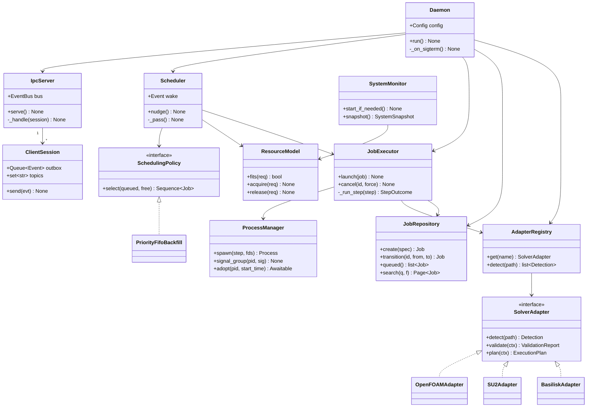

# Dispatch — Architecture

**Status:** Implemented. All phases complete; this document describes the code as built.
**Version:** 1.2 — Phase 1 design, approved with review changes
(no mandatory linger §2.1 · configurable policy §6.2 · adapter API version §8.1.1 ·
structured metadata §4.4 · tags §4.5 · provenance §6.9 · notifications §6.10 · dry run §6.11)
**Target host:** `Eddy` — single Linux workstation, headless, SSH-only
**Runtime:** Python 3.13, managed by `uv`

---

## 0. Reading guide

| Section | Answers |
|---|---|
| [1. Scope](#1-scope-and-non-goals) | What Dispatch is and refuses to be |
| [2. Process model](#2-process-model) | The two programs and their lifecycles |
| [3. Package layout](#3-package-layout) | Where every file lives |
| [4. Domain model](#4-domain-model) | Job, states, resources |
| [5. Database](#5-database) | Full schema, migrations, search |
| [6. Daemon internals](#6-daemon-internals) | Scheduler, executor, monitor, recovery |
| [7. IPC protocol](#7-ipc-protocol) | Wire format, methods, events |
| [8. Solver adapters](#8-solver-adapter-system) | The plugin interface |
| [9. TUI](#9-tui) | Screens, keys, update strategy |
| [10. Resource footprint](#10-resource-footprint) | How the budgets are met |
| [11. Failure modes](#11-failure-modes-and-recovery) | What breaks and what happens |
| [12. Testing](#12-testing-strategy) | How correctness is established |
| [13. Decision log](#13-decision-log) | Every choice, with rejected alternatives |
| [14. Roadmap](#14-implementation-roadmap) | Phase-by-phase deliverables |

---

## 1. Scope and non-goals

Dispatch manages **one machine**. That single constraint removes most of the complexity of a real
scheduler and is the justification for nearly every decision below.

**In scope:** a persistent queue, core-aware admission control, automatic case preparation,
process supervision, live log viewing, and a permanent searchable record of every run.

**Explicitly out of scope:** users, authentication, permissions, fair-share, partitions,
reservations, node management, accounting, job dependencies (deferred), array jobs (deferred),
checkpoint/restart, a network API, and a web interface.

Because there is exactly one user (`shu`) and one machine, Dispatch does not authenticate, does not
authorize, and does not negotiate. The Unix socket's file permissions *are* the security model.

### 1.1 The five hard requirements

These drive the architecture and are testable:

1. **TUI death never touches a simulation.** Jobs are children of the daemon, in their own session.
2. **Daemon death never kills a simulation.** Jobs survive, are re-adopted on restart, and their
   exit codes are still recovered.
3. **Reboot loses nothing** except the running processes themselves; the queue and history persist.
4. **Idle cost is effectively zero** — no busy loops, no periodic scans, measurable as 0.0% CPU.
5. **The scheduler contains zero solver knowledge.** Grep for `foam` in `dispatch/daemon/` must
   return nothing. This is enforced by a unit test.

---

## 2. Process model

```
┌──────────────────────────────────────────────────────────────────────┐
│  SSH session (ephemeral)                                             │
│                                                                      │
│    dispatch  ──────►  Textual TUI process                            │
│                          │                                           │
│                          │  AF_UNIX SOCK_STREAM, NDJSON              │
│                          │  ~/.local/run/dispatch/daemon.sock        │
└──────────────────────────┼───────────────────────────────────────────┘
                           │
┌──────────────────────────┼───────────────────────────────────────────┐
│  systemd --user  (survives logout via loginctl enable-linger)        │
│                          ▼                                           │
│    dispatchd  ────►  asyncio event loop                              │
│                        ├── IpcServer      (accept, dispatch, push)   │
│                        ├── Scheduler      (admission decisions)      │
│                        ├── Executor       (spawn, supervise, reap)   │
│                        ├── ResourceModel  (core/RAM ledger)          │
│                        ├── SystemMonitor  (psutil, on demand only)   │
│                        └── Repository     (SQLite, sole writer)      │
│                                    │                                 │
│                                    ▼                                 │
│                          setsid'd job process groups                 │
│                          (mpirun / simpleFoam / SU2_CFD / ...)       │
└──────────────────────────────────────────────────────────────────────┘
```

Two entry points, two console scripts:

| Command | Program | Lifecycle |
|---|---|---|
| `dispatchd` | daemon | systemd user service, months of uptime |
| `dispatch` | TUI | one per SSH session, disposable |

`dispatch` also carries a small non-interactive CLI surface (`dispatch submit`, `dispatch ls`,
`dispatch cancel <id>`, `dispatch search`) for scripting and for use inside `ssh host 'dispatch ls'`.
Both the TUI and the CLI are thin skins over the same `ipc.client.DaemonClient`.

### 2.1 Daemon lifecycle — four supported ways to run it

**systemd and linger are one option, never a requirement.** Dispatch must be installable on any
Debian-ish box without the user having to know that `loginctl` exists. `dispatchd` is an ordinary
foreground program that happens to be well-behaved; how it gets supervised is the user's choice.

| Mode | Command | Notes |
|---|---|---|
| Foreground | `dispatchd` | Logs to stderr. Correct for `Type=simple`, tmux, and debugging. |
| Self-detaching | `dispatchd --detach` | Double-fork + `setsid`, stdio to `daemon.log`, pidfile written, parent exits once the socket is accepting. |
| tmux / screen / nohup | `tmux new -d -s dispatch dispatchd` | Works because of foreground mode. No systemd involvement at all. |
| systemd user unit | `systemctl --user enable --now dispatchd` | Shipped in `packaging/`, uses foreground mode. Linger is *recommended*, not required. |

The linger question is about what happens to the daemon at logout, and the honest answer depends on
one setting the user did not choose:

- `logind.conf` `KillUserProcesses=no` — the Debian/Ubuntu **default**. A detached `dispatchd`
  survives logout with no linger and no systemd unit. This is the common case and it just works.
- `KillUserProcesses=yes` — user processes die at logout unless they are in a lingering user manager
  or an escaped scope.

So rather than mandating a fix for a problem most users do not have, `dispatchd` **detects the
hazard and reports it**. At startup it reads `KillUserProcesses` from logind's configuration and
checks whether it is running under a lingering user manager or inside a session scope. If it is in
the one combination that will not survive logout, it logs a single actionable warning naming the two
remedies (`loginctl enable-linger`, or `systemd-run --user --scope`) and **starts anyway** — the
user may well be about to stay logged in. `dispatch doctor` prints the same diagnosis on demand.

**Autostart.** When the TUI or CLI finds no daemon listening, it starts one with `--detach` and
retries, controlled by `[daemon] autostart = true` (default). This removes the last piece of
friction: a new user runs `dispatch`, and it works. Set `false` for supervised deployments where
something else owns the daemon's lifecycle.

### 2.2 Filesystem layout

All paths are XDG-derived and overridable in config.

```
~/.config/dispatch/config.toml         # user configuration (TOML, stdlib tomllib)
~/.local/share/dispatch/dispatch.db    # SQLite, WAL mode
~/.local/share/dispatch/logs/
    daemon.log                         # daemon's own rotating log
    jobs/<uuid>/stdout.log             # per-job, written by the kernel (see §6.4)
    jobs/<uuid>/stderr.log
    jobs/<uuid>/exit_code              # sentinel, survives daemon death (see §6.5)
    jobs/<uuid>/steps.log              # preparation step transcript (decomposePar &c.)
~/.local/run/dispatch/daemon.sock      # AF_UNIX, mode 0600
~/.local/run/dispatch/daemon.pid       # flock'd, single-instance guard
```

`~/.local/run` is used rather than `$XDG_RUNTIME_DIR` (`/run/user/1000`) because the latter is
cleared on logout on some configurations, and the daemon must outlive logout. The runtime dir is
recreated at daemon start; the socket is unlinked and rebound.

---

## 3. Package layout

```
dispatch/
├── pyproject.toml                 # uv-managed, requires-python = ">=3.13"
├── uv.lock
├── README.md
├── docs/
│   ├── ARCHITECTURE.md            # this document
│   └── adapters.md                # how to write a solver adapter
├── packaging/
│   └── dispatchd.service          # systemd --user unit
├── src/dispatch/
│   ├── __init__.py
│   ├── version.py
│   │
│   ├── core/                      # pure domain — no I/O, no asyncio, no SQL
│   │   ├── models.py              # Job, JobSpec, ResourceRequest, SystemSnapshot
│   │   ├── states.py              # JobState enum + transition table
│   │   ├── plan.py                # ExecutionPlan, CommandStep, StepOutcome, DryRunReport
│   │   ├── metadata.py            # MetadataSpec, MetadataField, structured envelope
│   │   ├── provenance.py          # Provenance dataclass (reproducibility record)
│   │   ├── tags.py                # tag normalisation + validation rules
│   │   ├── validation.py          # ValidationReport, Finding, Severity
│   │   ├── errors.py              # exception hierarchy
│   │   ├── config.py              # Config dataclasses + TOML loader
│   │   └── clock.py               # Clock protocol (injected; fake in tests)
│   │
│   ├── db/
│   │   ├── connection.py          # connect(), PRAGMAs, migration runner
│   │   ├── migrations/
│   │   │   └── 001_initial.sql
│   │   ├── repository.py          # JobRepository — the only SQL in the codebase
│   │   └── rows.py                # row <-> dataclass mapping
│   │
│   ├── ipc/
│   │   ├── protocol.py            # message dataclasses, method/event names, VERSION
│   │   ├── codec.py               # NDJSON encode/decode, framing, size limits
│   │   ├── client.py              # DaemonClient (async), used by TUI and CLI
│   │   └── errors.py              # ErrorCode enum shared by both sides
│   │
│   ├── daemon/
│   │   ├── main.py                # entry point, signal handling, wiring (DI root)
│   │   ├── server.py              # IpcServer, ClientSession, EventBus
│   │   ├── scheduler.py           # Scheduler — policy-agnostic admission loop
│   │   ├── policies.py            # PolicyRegistry: fifo, backfill (+ future)
│   │   ├── executor.py            # JobExecutor — plan execution, supervision
│   │   ├── process.py             # ProcessManager — spawn/signal/reap primitives
│   │   ├── resources.py           # ResourceModel — the core/RAM ledger
│   │   ├── monitor.py             # SystemMonitor, JobSampler (psutil)
│   │   ├── provenance.py          # environment/git/version capture at job start
│   │   ├── notify.py              # NotificationSink protocol + built-in sinks
│   │   ├── dryrun.py              # detect + validate + plan, without side effects
│   │   ├── recovery.py            # startup reconciliation of RUNNING jobs
│   │   ├── selfcheck.py           # startup capability + linger diagnosis (§2.1)
│   │   └── logsetup.py            # daemon logging configuration
│   │
│   ├── adapters/
│   │   ├── base.py                # SolverAdapter protocol, CaseContext, Detection
│   │   ├── registry.py            # AdapterRegistry, entry-point discovery
│   │   ├── detect.py              # detection orchestration + confidence ranking
│   │   ├── openfoam.py
│   │   ├── su2.py
│   │   ├── basilisk.py
│   │   └── shellenv.py            # capture env from a sourced shell script
│   │
│   ├── tui/
│   │   ├── app.py                 # DispatchApp (Textual)
│   │   ├── state.py               # client-side store fed by daemon events
│   │   ├── screens/
│   │   │   ├── dashboard.py
│   │   │   ├── queue.py
│   │   │   ├── submit.py          # filesystem browser + detect + validate wizard
│   │   │   ├── logs.py            # live log viewer
│   │   │   ├── history.py         # search
│   │   │   └── help.py
│   │   ├── widgets/
│   │   │   ├── meters.py          # CPU/RAM bars
│   │   │   ├── jobtable.py
│   │   │   ├── dirbrowser.py
│   │   │   └── logtail.py         # tail -f widget
│   │   └── tailer.py              # async file tailer (see §9.4)
│   │
│   └── cli.py                     # argparse front door: TUI by default, verbs otherwise
└── tests/
    ├── conftest.py                # fixtures: tmp db, fake clock, fake adapter
    ├── unit/                      # core, db, scheduler, adapters, codec
    ├── integration/               # daemon+client over a real socket, real subprocesses
    └── cases/                     # tiny synthetic OpenFOAM/SU2/Basilisk trees
```

**Dependency direction is strictly downward.** `core` imports nothing from Dispatch. `db`, `ipc`,
and `adapters` import only `core`. `daemon` imports `core`, `db`, `ipc`, `adapters`. `tui` imports
`core` and `ipc` — **never** `daemon`, `db`, or `adapters`. A unit test asserts this by walking the
import graph, which is what actually keeps the layering honest over time.

---

## 4. Domain model

### 4.1 Job

```python
@dataclass(frozen=True, slots=True)
class Job:
    id: UUID
    name: str
    workdir: Path
    solver: str                    # adapter name, e.g. "openfoam"
    solver_binary: str | None      # resolved application, e.g. "interFoam"
    cores: int
    ram_estimate_mb: int | None
    priority: int                  # higher runs first; default 0
    state: JobState
    seq: int                       # monotonic submission counter — FIFO tiebreak
    created_at: float
    started_at: float | None
    finished_at: float | None
    exit_code: int | None
    exit_reason: str | None
    stdout_path: Path
    stderr_path: Path
    pid: int | None
    pid_start_time: float | None   # PID-reuse guard
    tags: frozenset[str]           # user-defined labels — "paper", "re100000", "naca0018"
    metadata: CaseMetadata         # structured, adapter-declared (§4.4)
    provenance: Provenance | None  # reproducibility record, captured at start (§6.9)
    metrics: JobMetrics            # peak RSS, mean CPU, runtime — filled progressively
```

`Job` is frozen with `slots=True`: immutable snapshots are handed to the scheduler and pushed over
IPC, so nothing can mutate shared state accidentally, and `slots` removes the per-instance `__dict__`
(~50% of the memory of a plain dataclass at these object counts).

**Queue position is not a stored column.** It is derived at read time by
`ORDER BY priority DESC, seq ASC` over `state = 'QUEUED'`. Storing it would require rewriting every
row on each submission and would drift after a crash. The IPC layer exposes it as a computed field
so the TUI still sees `#1, #2, #3`.

### 4.2 State machine

```
             submit
               │
               ▼
          ┌─────────┐  validation fails (hard)   ┌──────────┐
          │ QUEUED  │ ─────────────────────────► │ REJECTED │
          └─────────┘                            └──────────┘
            │     ▲
   admitted │     │ release
            │     │
            │  ┌──────┐   hold
            │  │ HELD │ ◄──────── (from QUEUED)
            │  └──────┘
            ▼
       ┌───────────┐  prep fails   ┌────────┐
       │ PREPARING │ ────────────► │ FAILED │
       └───────────┘               └────────┘
            │                          ▲
            ▼                          │ non-zero exit / signal
       ┌─────────┐                     │
       │ RUNNING │ ────────────────────┤
       └─────────┘                     │
            │  │                       │
   exit 0   │  │ cancel                │
            ▼  ▼                       │
     ┌───────────┐  ┌───────────┐      │
     │ COMPLETED │  │ CANCELLED │      │
     └───────────┘  └───────────┘      │
                                       │
     ┌─────────┐  daemon restart, process gone, no exit sentinel
     │ UNKNOWN │ ◄────────────────────────────────────────────┘
     └─────────┘
```

Terminal states: `COMPLETED`, `FAILED`, `CANCELLED`, `REJECTED`, `UNKNOWN`.
`UNKNOWN` exists deliberately — it is honest about the one case where Dispatch genuinely cannot
determine what happened (machine hard-reset mid-run), rather than silently recording `FAILED`.

Transitions are declared in a frozen `dict[JobState, frozenset[JobState]]` and enforced in one
place, `Repository.transition()`, which rejects illegal moves at the SQL layer with a `CHECK`-backed
optimistic update (`UPDATE ... WHERE id = ? AND state = ?`). Every transition also appends a row to
`job_events`, giving a complete audit trail for free.

### 4.3 Resource model

```python
@dataclass(slots=True)
class ResourceModel:
    total_cores: int          # physical cores, not logical CPUs — see §8.7
    reserved_cores: int       # config, default 1 — keeps the box responsive over SSH
    allocated_cores: int      # Σ cores of PREPARING+RUNNING jobs — a ledger, not a measurement
    total_ram_mb: int
    ram_margin_mb: int        # config, default 2048
```

Admission is decided against the **ledger**, never against measured CPU load. Measured load is
displayed but never scheduled on: a solver that is momentarily blocked on I/O would otherwise look
"free" and Dispatch would oversubscribe the box. This is the single most important scheduling
decision in the design and it is why `htop` and Dispatch will sometimes disagree — correctly.

RAM gating is implemented from day one but only *engages* for jobs that declare
`ram_estimate_mb`; jobs without an estimate are admitted on cores alone. This satisfies "future
RAM-aware scheduling should be easy" by simply having already done the easy part.

### 4.4 Structured metadata

A bare `Mapping[str, Any]` is a place where information goes to become unsearchable. Every adapter
therefore **declares** the shape of what it extracts, and free-form data is confined to a corner:

```python
@dataclass(frozen=True, slots=True)
class MetadataField:
    key: str
    type: FieldType            # STR | INT | FLOAT | BOOL | PATH
    label: str                 # "Write interval"
    unit: str | None           # "s", "iterations", None
    searchable: bool = True    # promoted into the search index
    display_order: int = 100

class MetadataSpec:
    """Declared per adapter; drives storage, search, and TUI rendering."""
    fields: Sequence[MetadataField]
```

`OpenFOAMAdapter.metadata_spec` declares `application`, `deltaT`, `endTime`, `startTime`,
`writeInterval`, `writeControl`, `decomposition`, `decomposition_method`, `mesh_cells`. The stored
envelope is versioned so that a later adapter release can rename a field without orphaning history:

```json
{
  "spec": {"adapter": "openfoam", "version": 1},
  "case": {
    "application": "interFoam",
    "deltaT": 1e-4,
    "endTime": 600,
    "writeInterval": 100,
    "decomposition": 20,
    "decomposition_method": "scotch",
    "mesh_cells": 2418000
  },
  "extra": {}
}
```

`case` holds declared fields, type-checked against the spec on write. `extra` holds anything an
adapter wants to keep but has not committed to a schema for — it is stored and displayed, but only
`case` fields get typed search. Three payoffs: the TUI renders a metadata panel with correct labels
and units without knowing what OpenFOAM is; typed comparisons like `endTime>500` work; and an
adapter author's contract is explicit rather than a convention in a docstring.

### 4.5 Tags

Free-form user labels, normalised to lowercase, `[a-z0-9][a-z0-9._-]{0,63}`. A job may carry any
number. Tags are editable at any point in a job's life, including long after it has finished —
that is when you actually know a run was the one that made Figure 4.

Search integrates them as a first-class filter (`tag:paper`, `-tag:scratch`), and adapters may
*suggest* tags at submission (OpenFOAM suggests its application name) which the user accepts or
edits. Suggestions are never applied silently.

---

## 5. Database

SQLite, single file, WAL mode. **The daemon is the only writer**, and it holds one long-lived
connection — so there is no write contention, no connection pool, and no ORM.

```sql
PRAGMA journal_mode = WAL;        -- readers never block the writer
PRAGMA synchronous  = NORMAL;     -- fsync on checkpoint, not per-txn; correct with WAL
PRAGMA foreign_keys = ON;
PRAGMA busy_timeout = 5000;
PRAGMA temp_store   = MEMORY;
PRAGMA mmap_size    = 0;          -- deliberately off; see §13.6
```

### 5.1 Schema

```sql
CREATE TABLE schema_version (
    version     INTEGER PRIMARY KEY,
    applied_at  REAL NOT NULL
);

CREATE TABLE jobs (
    id                TEXT    PRIMARY KEY,            -- UUID4 canonical form
    seq               INTEGER NOT NULL UNIQUE,        -- monotonic; FIFO tiebreak
    name              TEXT    NOT NULL,
    workdir           TEXT    NOT NULL,
    solver            TEXT    NOT NULL,               -- adapter name
    solver_binary     TEXT,                           -- resolved application
    cores             INTEGER NOT NULL CHECK (cores >= 1),
    ram_estimate_mb   INTEGER CHECK (ram_estimate_mb IS NULL OR ram_estimate_mb > 0),
    priority          INTEGER NOT NULL DEFAULT 0,
    state             TEXT    NOT NULL CHECK (state IN (
                          'QUEUED','HELD','PREPARING','RUNNING',
                          'COMPLETED','FAILED','CANCELLED','REJECTED','UNKNOWN')),
    created_at        REAL    NOT NULL,
    started_at        REAL,
    finished_at       REAL,
    exit_code         INTEGER,
    exit_reason       TEXT,                           -- 'ok','nonzero','signal:TERM','oom','lost'
    stdout_path       TEXT    NOT NULL,
    stderr_path       TEXT    NOT NULL,
    pid               INTEGER,
    pid_start_time    REAL,                           -- /proc create_time; defeats PID reuse
    metadata          TEXT    NOT NULL DEFAULT '{}',  -- JSON object, solver-specific

    -- forward-declared metrics (§5.4); NULL until a later phase populates them
    runtime_s         REAL,
    peak_rss_mb       INTEGER,
    mean_cpu_pct      REAL,

    CHECK (json_valid(metadata))
);

-- The scheduler's hot query. Partial index: only queued rows are indexed, so the
-- index stays at a handful of entries no matter how large history grows.
CREATE INDEX idx_jobs_queue   ON jobs (priority DESC, seq ASC) WHERE state = 'QUEUED';
CREATE INDEX idx_jobs_active  ON jobs (state) WHERE state IN ('PREPARING','RUNNING');
CREATE INDEX idx_jobs_recent  ON jobs (finished_at DESC) WHERE finished_at IS NOT NULL;

CREATE TABLE job_events (
    id       INTEGER PRIMARY KEY AUTOINCREMENT,
    job_id   TEXT NOT NULL REFERENCES jobs(id) ON DELETE CASCADE,
    ts       REAL NOT NULL,
    kind     TEXT NOT NULL,      -- 'state','step','signal','warn','note'
    detail   TEXT NOT NULL       -- human-readable one-liner
);
CREATE INDEX idx_events_job ON job_events (job_id, id);

CREATE TABLE notes (
    id       INTEGER PRIMARY KEY AUTOINCREMENT,
    job_id   TEXT NOT NULL REFERENCES jobs(id) ON DELETE CASCADE,
    ts       REAL NOT NULL,
    body     TEXT NOT NULL
);
CREATE INDEX idx_notes_job ON notes (job_id);

-- Time series for long-running jobs: one row per sample, coarse (§6.6).
CREATE TABLE job_samples (
    job_id   TEXT NOT NULL REFERENCES jobs(id) ON DELETE CASCADE,
    ts       REAL NOT NULL,
    rss_mb   INTEGER NOT NULL,
    cpu_pct  REAL NOT NULL,
    PRIMARY KEY (job_id, ts)
) WITHOUT ROWID;

-- Tags (§4.5). Normalised so renaming a tag is one UPDATE and listing all tags is one scan.
CREATE TABLE tags (
    id    INTEGER PRIMARY KEY AUTOINCREMENT,
    name  TEXT NOT NULL UNIQUE COLLATE NOCASE
);
CREATE TABLE job_tags (
    job_id  TEXT    NOT NULL REFERENCES jobs(id) ON DELETE CASCADE,
    tag_id  INTEGER NOT NULL REFERENCES tags(id) ON DELETE CASCADE,
    PRIMARY KEY (job_id, tag_id)
) WITHOUT ROWID;
CREATE INDEX idx_job_tags_tag ON job_tags (tag_id, job_id);   -- "all jobs tagged X"

-- Derived, typed index over declared metadata fields (§4.4). The JSON column on `jobs`
-- stays canonical; this table exists so `endTime > 500` is an index seek, not a JSON scan.
CREATE TABLE job_metadata (
    job_id     TEXT NOT NULL REFERENCES jobs(id) ON DELETE CASCADE,
    key        TEXT NOT NULL,
    value_text TEXT,
    value_num  REAL,
    PRIMARY KEY (job_id, key)
) WITHOUT ROWID;
CREATE INDEX idx_meta_key_num  ON job_metadata (key, value_num)  WHERE value_num  IS NOT NULL;
CREATE INDEX idx_meta_key_text ON job_metadata (key, value_text) WHERE value_text IS NOT NULL;

-- Reproducibility record (§6.9). One row per job, written once at job start.
CREATE TABLE job_provenance (
    job_id           TEXT PRIMARY KEY REFERENCES jobs(id) ON DELETE CASCADE,
    captured_at      REAL NOT NULL,
    dispatch_version TEXT NOT NULL,
    python_version   TEXT NOT NULL,
    hostname         TEXT NOT NULL,
    kernel_version   TEXT NOT NULL,
    os_release       TEXT,
    cpu_model        TEXT,
    total_ram_mb     INTEGER,
    solver_name      TEXT,
    solver_version   TEXT,            -- "OpenFOAM-v2312", "SU2 8.0.1 Harrier"
    adapter_version  INTEGER,         -- adapter's own revision, not the API version
    git_commit       TEXT,            -- of the CASE directory, if it is in a repo
    git_branch       TEXT,
    git_dirty        INTEGER,         -- 0/1 — uncommitted changes at launch
    git_remote       TEXT,
    env_snapshot     TEXT NOT NULL DEFAULT '{}',   -- JSON, adapter-declared keys only
    env_hash         TEXT,            -- sha256 of the FULL environment, for exact comparison
    argv             TEXT NOT NULL,   -- JSON array: the exact SOLVE command executed
    CHECK (json_valid(env_snapshot) AND json_valid(argv))
);
```

### 5.2 Search

Full-text search over the things worth searching, using SQLite's built-in FTS5 (no dependency):

```sql
CREATE VIRTUAL TABLE jobs_fts USING fts5(
    id UNINDEXED, name, workdir, solver, solver_binary, metadata, notes,
    tokenize = 'unicode61 remove_diacritics 2'
);
```

Kept in sync by triggers on `jobs` and `notes`. `metadata` is flattened to a
`key value key value` string on write so `search: endTime` and `search: 2500` both hit. This gives
instant search across years of history without `LIKE '%...%'` table scans, and the index cost on a
few thousand rows is under a megabyte.

**Query language.** A single input box accepts bare words (FTS match) mixed with typed terms,
because typing `tag:paper solver:openfoam cores>=16` is faster than operating four dropdowns:

| Term | Meaning |
|---|---|
| `naca0018` | free text across name, workdir, notes, metadata |
| `tag:paper`, `-tag:scratch` | has / lacks a tag |
| `solver:openfoam`, `state:failed` | enumerated field equality |
| `app:interFoam` | `solver_binary` |
| `endTime>500`, `deltaT<=1e-4` | typed comparison on any declared metadata field (§4.4) |
| `cores>=16`, `runtime>2h` | job columns, with unit-suffix parsing |
| `after:2026-01-01`, `before:2026-06` | date ranges on `created_at` |
| `dirty:true` | launched from a git repo with uncommitted changes (§6.9) |

Parsing happens in `core/query.py` (pure, exhaustively unit-tested) and produces a `SearchQuery`
dataclass. `Repository.search()` compiles that into one parameterised SQL statement joining
`jobs_fts`, `job_tags`, and `job_metadata`. Unknown keys become a clear error rather than being
silently treated as free text — a typo'd `taag:paper` must not quietly return the wrong answer to a
question about which runs made a figure. Results are `LIMIT`-paged, which also bounds the IPC
payload (§7.5).

### 5.3 Migrations

Plain numbered `.sql` files applied in a transaction, tracked in `schema_version`. No Alembic, no
ORM. The runner is ~40 lines: read `PRAGMA user_version`, apply every file above it, bump. Forward
only. On a version *newer* than the code understands, the daemon refuses to start rather than
corrupting data — a real risk on a machine that runs for months across upgrades.

### 5.4 Metadata coverage

Every field named in the original brief as "future metadata" now has a home in the initial schema,
and most are populated from day one rather than deferred:

| Field | Location | Populated |
|---|---|---|
| Runtime | `jobs.runtime_s` | Phase 2 — on terminal transition |
| Exit reason | `jobs.exit_reason` | Phase 2 |
| Hostname, kernel, OS, CPU model, RAM | `job_provenance` | Phase 2 |
| Dispatch version, Python version | `job_provenance` | Phase 2 |
| Git commit / branch / dirty / remote | `job_provenance` | Phase 2 |
| Exact `argv` executed | `job_provenance.argv` | Phase 2 |
| Environment snapshot + hash | `job_provenance.env_*` | Phase 2 |
| Max RAM usage, mean CPU | `jobs.peak_rss_mb`, `mean_cpu_pct`, `job_samples` | Phase 2 |
| Solver version | `job_provenance.solver_version` | Phase 4+ (needs adapters) |
| Solver case settings | `jobs.metadata` (`case`) | Phase 4+ |

Anything genuinely unforeseen goes in the `extra` section of the metadata JSON, which needs no
migration at all.

---

## 6. Daemon internals

### 6.1 The event loop, and why it sleeps

The daemon has exactly these wakeup sources:

| Source | Mechanism | Frequency |
|---|---|---|
| Client connects / sends a request | `epoll` on the listening socket | on demand |
| A job process exits | `SIGCHLD` → asyncio child watcher | on job completion |
| A re-adopted job exits | `pidfd_open` + `add_reader` | on job completion |
| Dashboard sampling | `asyncio.sleep` timer | **only while a client is subscribed** |
| Job resource sampling | `asyncio.sleep` timer | only while a job is running, 30 s |
| Safety heartbeat | `asyncio.sleep` | 30 s |

With no jobs and no clients, the loop blocks in `epoll_wait` and wakes twice a minute for a
heartbeat that compares the ledger to reality and returns. Idle CPU is 0.0%.

The dashboard sampler is the important one: `SystemMonitor` starts its timer on the first
subscriber and cancels it on the last unsubscribe. **Nobody watching means nothing is measured.**

### 6.2 Scheduler

```python
class SchedulingPolicy(Protocol):
    def select(self, queued: Sequence[Job], free: Resources) -> Sequence[Job]: ...
```

The scheduler is a single coroutine parked on an `asyncio.Event`. It is nudged by: submission,
job termination, hold/release, priority change, and config reload. There is no scheduling tick.

```python
async def run(self) -> None:
    while not self._stopping:
        await self._wake.wait()
        self._wake.clear()
        await self._pass()          # one admission pass, then back to sleep
```

Policies are named, registered, and **selected in configuration** — the scheduler never mentions a
concrete policy class:

```toml
[scheduler]
policy = "backfill"        # "fifo" | "backfill"
```

```python
POLICIES: dict[str, type[SchedulingPolicy]] = {}   # + "dispatch.policies" entry points

def build_policy(name: str, cfg: SchedulerConfig) -> SchedulingPolicy: ...
```

Shipped in Phase 2: `fifo` (strict priority then submission order, head-of-line blocking and all)
and `backfill` (below, the default). Reserved names with a defined meaning for later —
`easy-backfill` (needs runtime estimates from history), `shortest-first`, `largest-first` — require
only a new class and a dict entry. An unknown policy name is a startup error listing the valid ones,
not a silent fallback to the default; a typo in `config.toml` must not quietly change how the
machine schedules for six months.

**Default policy — `PriorityFifoBackfill`:**

1. Sort queued jobs by `(priority DESC, seq ASC)`.
2. Walk the list. Start any job that fits in the free ledger.
3. When a job does *not* fit, **reserve** its resources notionally and continue walking — later
   jobs may still start, but only if they fit in what remains *after* the reservation.

Step 3 is backfill-lite. Without it, one 24-core job at the head of the queue blocks four 4-core
jobs behind it for a day. Without the reservation, a stream of small jobs starves the big one
forever. This is the standard compromise and it is ~15 lines. Policy is injected, so a different
one (pure FIFO, or a duration-aware EASY backfill once runtime history exists) is a constructor
argument, not a rewrite.

The scheduler operates on `Job` snapshots and a `Resources` value object. It calls
`executor.launch(job)` and knows nothing else about how a job runs.

### 6.3 Executor and the ExecutionPlan

This is where the "scheduler knows nothing about solvers" requirement is actually cashed out.

```python
@dataclass(frozen=True, slots=True)
class CommandStep:
    argv: Sequence[str]
    cwd: Path
    env: Mapping[str, str] | None
    description: str                  # "Decomposing case into 16 subdomains"
    kind: StepKind                    # PREPARE | SOLVE | CLEANUP
    on_failure: FailureAction         # ABORT | WARN
    timeout_s: float | None

@dataclass(frozen=True, slots=True)
class ExecutionPlan:
    steps: Sequence[CommandStep]      # exactly one step has kind == SOLVE
```

The executor's whole job:

1. Ask the adapter for a plan: `plan = adapter.plan(job, ctx)`.
2. Run `PREPARE` steps sequentially, transcript to `steps.log`, job in state `PREPARING`.
3. Run the `SOLVE` step, transition to `RUNNING`, record pid + pid_start_time.
4. Await exit, classify, transition to a terminal state, release the ledger, nudge the scheduler.

`decomposePar` is a `PREPARE` step. `reconstructPar` is a `PREPARE` step. `mpirun -np 16 interFoam
-parallel` is the `SOLVE` step. The executor cannot tell them apart, and that is the point.

### 6.4 Zero-copy job logging

Job stdout/stderr are **not** piped through the daemon. The executor opens the log files and passes
the file descriptors directly to `create_subprocess_exec(stdout=fd, stderr=fd2)`. The kernel writes
solver output straight to disk; the daemon never sees a byte, allocates no buffers, and is never
woken by chatty output.

A solver that prints 40 MB of residuals over three days costs the daemon exactly zero.

The cost of this choice: the daemon cannot parse progress from a live pipe. Recovered by having
`JobSampler` read the **last 8 KB** of the log every 30 s and hand those lines to
`adapter.parse_progress()` to extract the current timestep. One `pread` per job per 30 s is
nothing, and it keeps the hot path untouched. (The TUI's live log viewer reads the file directly —
§9.4 — so tailing also never involves the daemon.)

### 6.5 Process supervision

```python
proc = await asyncio.create_subprocess_exec(
    *step.argv, cwd=step.cwd, env=env,
    stdout=out_fd, stderr=err_fd, stdin=DEVNULL,
    start_new_session=True,          # setsid: own session + process group
)
```

`start_new_session=True` is load-bearing three times over:

- The job is detached from the daemon's controlling terminal, so a stray `Ctrl-C` cannot reach it.
- The whole MPI process tree shares one process group, so cancellation can signal all of it with
  `os.killpg` instead of hunting children.
- The daemon can exit without SIGHUP'ing its jobs.

**Exit-code durability.** A process reparented to init after a daemon crash cannot be `wait()`ed,
so its exit code is unrecoverable through normal means. The `SOLVE` step is therefore wrapped:

```sh
/bin/sh -c 'exec 3>&1; "$@" ; ec=$?; printf %d "$ec" > "$EXIT_FILE"; exit $ec' _ <argv...>
```

The exit code lands in a file on disk before the shell exits. Whether the daemon is alive to
`wait()` or reads the sentinel three hours later after a restart, the answer is the same. This is
a small amount of ugliness that buys requirement #2 outright.

**Cancellation ladder:** `SIGINT` to the process group → wait `grace_s` (default 10) →
`SIGTERM` → wait 10 s → `SIGKILL`. `SIGINT` first because most CFD solvers treat it as
"write and stop cleanly". Adapters may override with a solver-native graceful stop —
`OpenFOAMAdapter.stop_gracefully()` writes `stopAt writeNow;` into `system/controlDict`, which is
the correct way to stop a Foam run with a usable final write.

### 6.6 Monitoring

`SystemMonitor` samples `psutil.cpu_percent(interval=None)` and `psutil.virtual_memory()` on a
2 s timer **only while subscribers exist**. `psutil.Process` handles for running jobs are cached
in a dict keyed by pid so `/proc` files are reopened, not re-scanned.

`JobSampler` walks each running job's process tree every 30 s for `rss` and `cpu_percent`, writing
to `job_samples` and maintaining `peak_rss_mb` / `mean_cpu_pct` on the job row. 30 s over a
multi-day run is ~2900 rows per job — small, and genuinely useful for "how much RAM did that
actually need?" the next time a similar case is queued. Samples for terminal jobs are downsampled
by a retention job (config, default: keep full resolution 7 days, then 1-in-10).

**Progress is sampled separately, and far more often** (`daemon.progress_interval_s`, default
5 s). Reading a job's current time step is one `pread` of the last 8 KB of its log; a resource
sample walks a whole process tree. Sharing one timer would force a choice between walking process
trees every five seconds and watching a solver's time step update twice a minute. The two loops
publish to the same `job.progress` topic with disjoint fields, so clients **merge** rather than
replace — otherwise each sampler erases the other's half of the picture between updates.

The current time step is displayed as a value in its own right (`t 0.35/50`), not folded into a
percentage. They answer different questions: the percentage estimates how much longer, the time
step says where the solution actually is — and it is the only one of the two that exists at all
for a case with no declared end time.

**Failure reasons.** When a job reaches `FAILED`, the executor reads the tail of its stderr,
stdout, and step transcript and asks the adapter to summarise it (`explain_failure`), storing the
result in `jobs.exit_detail` for `dispatch show`, the log viewer, and failure notifications. An
exit code says a run failed and never says why, and the answer is always sitting in a log the user
then has to go and open. Preparation failures are covered too, reading the step transcript — a
decomposition that will not divide is among the most explicable failures there is, and none of its
output reaches the solver's own log.

### 6.7 Startup recovery

Run before the socket is bound, so no client sees an inconsistent world:

For every job in `PREPARING` or `RUNNING`:

1. Read `exit_code` sentinel. If present → job finished while we were away. Set terminal state
   using the recorded code, `finished_at` from the file's mtime. Done.
2. Else check `pid`. If `/proc/<pid>` exists **and** its `create_time()` matches the stored
   `pid_start_time` (PID reuse guard) → the job is still running. Re-adopt: `os.pidfd_open(pid)`,
   register with `loop.add_reader` for event-driven exit notification without being the parent.
   Restore its cores to the ledger.
3. Else → the process is gone and left no sentinel. State `UNKNOWN`, `exit_reason = 'lost'`.

Then rebuild the ledger from surviving jobs and nudge the scheduler once. A daemon restart during
a 3-day simulation is a non-event: the job keeps running, the dashboard shows it, and its exit code
is still captured.

### 6.8 Signals and shutdown

| Signal | Behaviour |
|---|---|
| `SIGTERM`/`SIGINT` | Stop admitting. Flush DB. Close socket. **Leave running jobs alone.** Exit. |
| `SIGHUP` | Reload `config.toml` (cores, margins, log paths), nudge scheduler. No restart. |

Shutdown never kills simulations. Stopping Dispatch and stopping your work are different actions,
and conflating them would be unforgivable on a machine running week-long cases.

### 6.9 Provenance capture

Captured **once, at job start**, between the last `PREPARE` step and the `SOLVE` spawn — that is the
moment the answer is true. Capturing at submit time would miss changes made while the job sat in the
queue for two days; capturing at finish would miss a git checkout during the run.

```python
class ProvenanceCollector:
    def capture(self, job: Job, plan: ExecutionPlan, env: Mapping[str, str]) -> Provenance
```

Sources, all cheap and none fatal on failure:

| Item | Source |
|---|---|
| Dispatch / Python version | `dispatch.version`, `sys.version` |
| Hostname, kernel, OS | `os.uname()`, `/etc/os-release` |
| CPU model, total RAM | `/proc/cpuinfo` (first `model name`), `psutil` |
| Git commit / branch / dirty / remote | `git -C <workdir> rev-parse HEAD`, `symbolic-ref`, `status --porcelain`, `remote get-url origin` |
| Solver version | `adapter.solver_version(ctx)` — cached per daemon lifetime |
| Environment | adapter-declared `env_keys` only, plus sha256 of the complete environment |
| Exact command | the `SOLVE` step's `argv`, verbatim |

Three design points worth stating:

**The git commit is the case directory's, not Dispatch's.** Dispatch's own version is recorded
separately. Six months later the question is "what was the case when this ran", and `git_dirty` is
the field that will actually save you — a clean commit hash on a dirty tree is a lie that looks like
provenance.

**The environment is filtered, not dumped.** A full `environ` dump is large, changes constantly for
irrelevant reasons (`SSH_AUTH_SOCK`, `TMUX`), and can contain tokens. Each adapter declares the keys
that matter to it (`WM_PROJECT_DIR`, `FOAM_USER_LIBBIN`, `MPI_ARCH_PATH`, `OMP_NUM_THREADS`, …).
Those are stored verbatim; everything else is folded into `env_hash`, so "did these two runs have
identical environments?" is still answerable exactly without storing the environments.

**Collection never fails a job.** Every probe is wrapped; a missing `git`, an unreadable
`/etc/os-release`, or an adapter that cannot determine its solver version yields a `NULL` column and
a `job_events` warning. Reproducibility metadata is valuable, but not more valuable than the run.

Subprocess probes (`git`, `--version` calls) run with a 5 s timeout in a thread executor, so a
network-mounted repo cannot stall the event loop.

### 6.10 Notifications

The daemon already has an internal event bus for IPC push (§7.5). Notifications subscribe to the
same bus, so no scheduler or executor code participates:

```python
class NotificationSink(Protocol):
    name: ClassVar[str]
    async def deliver(self, note: Notification) -> None
```

```toml
[notifications]
on    = ["job.completed", "job.failed", "job.cancelled", "queue.drained"]
sinks = ["log"]

[notifications.ntfy]
topic = "eddy-dispatch"
```

Phase 2 ships `log` only. `desktop` (`notify-send`), `ntfy`, `discord`, and `email` are sinks to be
written later, discovered through the `dispatch.sinks` entry-point group; adding one touches no
existing file. Delivery is fire-and-forget on a bounded queue with a per-sink timeout and failure
backoff — a dead webhook must never delay a job transition or accumulate memory. That constraint is
why the interface is `async def deliver` on a queue rather than a synchronous callback.

### 6.11 Dry run

`DryRunner` reuses the exact code path a real submission takes, and stops before anything happens:

```python
async def dry_run(self, req: SubmitRequest) -> DryRunReport:
    detections = self.registry.detect(req.workdir)
    adapter    = self.registry.get(chosen.solver)
    report     = adapter.validate(ctx)
    plan       = adapter.plan(ctx)          # declarative — describes, does not act
    return DryRunReport(detections, report, plan, self.resources.projection(req), ...)
```

Nothing is written to the database, no process is spawned, no file in the case is touched. This is
essentially free precisely because of §13.9: `plan()` returns data, so *building* a plan and
*running* one are already separate operations. Had adapters spawned their own processes, dry-run
would have required a parallel no-op implementation of every adapter — and it would have drifted.

```
$ dispatch submit ~/projects/work/vit/foam/foamacoustic --cores 20 --dry-run

  Case        ~/projects/work/vit/foam/foamacoustic
  Detected    OpenFOAM  (confidence 0.95)  ·  application: interFoam
  Requested   20 cores  ·  priority 0  ·  RAM estimate: none

  Validation  PASS  (1 note)
    · existing decomposition is 8, requested 20 — case will be re-decomposed

  Execution plan
    1  PREPARE  reconstructPar -latestTime
    2  PREPARE  rm -rf processor*
    3  PREPARE  decomposePar -force
    4  SOLVE    mpirun -np 20 interFoam -parallel
       cwd  ~/projects/work/vit/foam/foamacoustic
       log  ~/.local/share/dispatch/logs/jobs/<uuid>/stdout.log

  Scheduling  20 of 23 cores free — would start immediately
  Nothing was submitted.
```

The same report backs the TUI wizard's confirmation step (`d` toggles the plan view), so what you
see before pressing Enter is generated by the code that will run, not by a description of it.

---

## 7. IPC protocol

### 7.1 Transport

`AF_UNIX`, `SOCK_STREAM`, mode `0600`, **newline-delimited JSON**. One JSON object per line;
`json.dumps` escapes embedded newlines, so `\n` is an unambiguous frame delimiter.

Chosen over: HTTP/REST (excluded by requirement, and a TCP port on a shared machine is a liability),
gRPC/protobuf (a code generator and two dependencies to save microseconds on ~10 messages/second),
msgpack (a dependency, and undebuggable), and a raw length-prefixed binary format (fast, opaque,
and unnecessary).

NDJSON's decisive advantage is that the entire protocol is debuggable with:

```sh
socat - UNIX-CONNECT:~/.local/run/dispatch/daemon.sock
{"t":"req","id":1,"method":"job.list","params":{}}
```

On a headless box you will be debugging over SSH at some point, and that matters more than the
serialization cost of a few kilobytes.

### 7.2 Message shapes

```jsonc
// request
{"t": "req", "id": 17, "method": "job.submit", "params": {...}}
// response
{"t": "res", "id": 17, "ok": true,  "result": {...}}
{"t": "res", "id": 17, "ok": false, "error": {"code": "VALIDATION_FAILED", "message": "...", "detail": {...}}}
// server-initiated event (no id)
{"t": "evt", "event": "job.state", "data": {...}}
```

Requests carry a client-chosen monotonic `id`; responses echo it. The client is fully async and
pipelined — multiple in-flight requests are matched by id, so a slow `history.search` never blocks
a `job.cancel`.

### 7.3 Handshake and versioning

First message on every connection:

```jsonc
{"t":"req","id":0,"method":"hello","params":{"protocol":1,"client":"dispatch-tui/1.0"}}
```

A protocol mismatch returns a clear error naming both versions and the daemon closes the socket.
A TUI from a newer install talking to an old running daemon is the single most likely real-world
version skew (you upgrade, you forget to `systemctl --user restart dispatchd`), so it must fail
with "restart the daemon", not a `KeyError`.

### 7.4 Methods

| Method | Params → Result |
|---|---|
| `hello` | protocol, client → daemon version, protocol, hostname, boot time |
| `daemon.info` | — → version, uptime, pid, db path, adapter names |
| `system.snapshot` | — → cores total/free/allocated, RAM, load, per-core % |
| `job.submit` | workdir, name?, solver?, cores, ram?, priority?, notes? → job |
| `job.list` | states?, limit?, offset? → jobs + derived queue positions |
| `job.get` | id → job, events, notes, latest samples |
| `job.cancel` | id, force? → ack |
| `job.hold` / `job.release` | id → job |
| `job.priority` | id, priority → job |
| `job.delete` | id (terminal only), purge_logs? → ack |
| `job.note` | id, body → note |
| `job.tag` | id, add[], remove[] → job |
| `tags.list` | — → tag names with job counts |
| `job.provenance` | id → full reproducibility record |
| `history.search` | query string (§5.2 syntax), limit, offset → page of jobs |
| `case.detect` | path → detections ranked by confidence |
| `case.validate` | path, solver, cores → ValidationReport |
| `case.dryrun` | same params as `job.submit` → DryRunReport (§6.11), no side effects |
| `fs.list` | path → directories (+ per-entry "looks like a case" hint) |
| `subscribe` / `unsubscribe` | topics → ack |

`fs.list` runs daemon-side rather than in the TUI so that the "this directory is an OpenFOAM case"
hint in the browser comes from the real adapters — the TUI stays solver-ignorant, per §3.

### 7.5 Events and backpressure

Topics: `jobs` (state changes, progress), `queue` (ordering changed), `system` (CPU/RAM
snapshots), `daemon` (shutdown, config reload).

Each `ClientSession` owns a **bounded** `asyncio.Queue(maxsize=256)`. If a client stalls (suspended
TUI, frozen SSH pipe) the queue fills; the session then drops the backlog, emits a single
`{"event":"resync"}` and continues. A wedged TUI must never grow the daemon's memory or block the
scheduler — over months of uptime, unbounded queues are how daemons die.

Response payloads are bounded too: `job.list` and `history.search` are `LIMIT`-paged (default 200,
hard max 1000), and a 4 MB per-message ceiling is enforced by the codec in both directions.

---

## 8. Solver adapter system

### 8.1 The interface

```python
ADAPTER_API_VERSION = 1     # dispatch.adapters.base — bumped only on breaking changes


class SolverAdapter(Protocol):
    api_version: ClassVar[int]            # must equal ADAPTER_API_VERSION to load
    name: ClassVar[str]                   # "openfoam"
    display_name: ClassVar[str]           # "OpenFOAM"
    adapter_version: ClassVar[int]        # this adapter's own revision, recorded in provenance
    metadata_spec: ClassVar[MetadataSpec] # declared fields (§4.4)
    env_keys: ClassVar[Sequence[str]]     # environment variables worth recording (§6.9)

    @classmethod
    def detect(cls, path: Path) -> Detection | None:
        """Cheap, read-only. Return None if this is not our kind of case."""

    def validate(self, ctx: CaseContext) -> ValidationReport:
        """Pre-flight checks. Findings at INFO / WARNING / ERROR."""

    def plan(self, ctx: CaseContext) -> ExecutionPlan:
        """Build the ordered steps that prepare and run this case."""

    def parse_progress(self, tail: str) -> Progress | None:
        """Extract current time / iteration from the last chunk of the log."""

    def collect_metadata(self, ctx: CaseContext) -> CaseMetadata:
        """Structured case settings, validated against metadata_spec (§4.4)."""

    def solver_version(self, ctx: CaseContext) -> str | None:
        """Solver build identity for provenance (§6.9). Cached per daemon lifetime."""

    def suggest_tags(self, ctx: CaseContext) -> Sequence[str]:
        """Optional tag suggestions, offered to the user — never applied silently."""

    def stop_gracefully(self, ctx: CaseContext) -> bool:
        """Optional solver-native clean stop. Return False to use the signal ladder."""

    def finalize(self, ctx: CaseContext) -> None:
        """Undo case edits made to steer *this* run. Called however the run ended."""

    def explain_failure(self, tail: str, ctx: CaseContext) -> str | None:
        """Why it failed, read out of the end of its own output (§6.6)."""
```

`finalize` exists because `stop_gracefully` usually works by **editing the case**, and such an
edit is only correct for the run it stopped. OpenFOAM's is the motivating example: cancelling
sets `stopAt writeNow` in `controlDict`, and left in place that makes every subsequent run of the
case write once and exit at its first time step — exiting 0, so nothing reports a problem and the
case simply appears to have stopped working. The executor calls `finalize` from a `finally`, so
cancellation and crash paths cannot skip it, and synchronously, because an `await` in a `finally`
during task cancellation would be interrupted before the restore happened. It is for run control
only: a cancelled run's *results* belong to the user and Dispatch does not delete them.

### 8.1.1 API versioning

`api_version` is checked when an adapter is registered. A mismatch is refused with a message naming
both versions and the adapter's distribution, and **the daemon still starts** with the remaining
adapters — one stale third-party plugin must not take the scheduler down along with three months of
queued work. `dispatch doctor` lists loaded and rejected adapters.

The contract that `ADAPTER_API_VERSION` covers is exactly: the method set above, their signatures,
and the semantics of `CaseContext`, `Detection`, `ValidationReport`, `ExecutionPlan`, and
`CaseMetadata`. Additive changes (a new optional method with a default) do not bump it; removing or
changing the meaning of anything listed does. `adapter_version` is separate and unpoliced — it is
the adapter author's own revision counter, recorded in each job's provenance so that "this run was
produced by OpenFOAM adapter rev 3" is answerable later.

`CaseContext` bundles `workdir`, requested `cores`, resolved environment, the job's metadata, and a
`Logger` — dependency-injected so adapters are testable with a temp directory and no daemon.

Every method is pure-ish and side-effect-light except `plan()` (which only *describes* side
effects) and `stop_gracefully()`. Adapters never spawn processes themselves; they return steps and
let the executor run them. That keeps supervision, logging, timeouts, and cancellation in exactly
one place.

### 8.2 Registration and detection

Built-in adapters register in `AdapterRegistry` at import. Third-party adapters are discovered via
the `dispatch.adapters` entry-point group, so `uv pip install dispatch-calculix` is the entire
integration story.

Detection runs every registered adapter's `detect()` and ranks by `Detection.confidence`
(0.0–1.0). Unambiguous winner → used silently, per the requirement to never ask when detection
succeeds. A tie or an empty result is the *only* case that prompts the user.

### 8.3 OpenFOAM adapter

**Detect** (confidence 0.95): `system/controlDict` exists. Parse it with a small purpose-built
tokenizer — the Foam dictionary format is not JSON and regexing it is a trap — and read
`application`. Also read `startFrom`, `endTime`, `writeInterval`, `deltaT` into metadata.

**Validate:**

| Check | Severity if missing |
|---|---|
| `system/`, `constant/`, `0/` (or a valid latest time dir) | ERROR |
| `system/controlDict`, `fvSchemes`, `fvSolution` | ERROR |
| Mesh: `constant/polyMesh/owner` **or** `processor0/constant/polyMesh/owner` | ERROR |
| `application` resolvable on `PATH` after env setup | ERROR |
| `system/decomposeParDict` present when cores > 1 | WARNING (adapter can synthesize one) |
| `0.orig/` present but `0/` absent | WARNING — likely needs `Allrun`-style setup |
| Existing decomposition ≠ requested cores | INFO — explains the re-decompose that will happen |

**Plan — the decomposition logic.** Count `processorN` directories:

| Situation | Steps generated |
|---|---|
| cores = 1, no processor dirs | `[SOLVE: <app>]` |
| cores = N, exactly N processor dirs exist | `[SOLVE: mpirun -np N <app> -parallel]` — reuse |
| cores = N, M processor dirs exist, M ≠ N | `[PREPARE: reconstructPar -latestTime]`, `[PREPARE: rm -rf processor*]`, `[PREPARE: decomposePar -force]`, `[SOLVE: mpirun -np N <app> -parallel]` |
| cores = N > 1, no processor dirs | `[PREPARE: decomposePar -force]`, `[SOLVE: mpirun ...]` |
| cores = 1, M processor dirs exist | `[PREPARE: reconstructPar -latestTime]`, `[SOLVE: <app>]` (processor dirs left in place) |

When re-decomposing, `system/decomposeParDict` is rewritten with `numberOfSubdomains N` and a
`scotch` coefficient block if the file is absent or disagrees — done as an idempotent edit that
preserves the rest of the user's dictionary.

**No `reconstructPar` after the solve.** Explicitly required, and correct: reconstruction on a
large case can take longer than the solve, and post-processing with `paraFoam -builtin` or
`foamToVTK` on the decomposed case is the normal workflow. The decomposed case is left exactly as
the solver left it.

**Environment.** OpenFOAM requires a sourced `etc/bashrc`. `shellenv.capture()` runs
`bash -lc 'source <bashrc> >/dev/null 2>&1 && env -0'` **once at daemon start**, caches the
resulting environment dict, and reuses it for every Foam job. One shell invocation per daemon
lifetime, not per job. The bashrc path is config (`[adapters.openfoam] bashrc = "..."`); if unset,
the adapter probes the usual locations and reports a clear ERROR finding if it cannot find one.

**Progress:** `^Time = ([0-9.eE+-]+)` from the log tail, compared against `endTime` from
`controlDict` to produce a real percentage.

**Cancellation edits the case, and puts it back.** `stop_gracefully` sets `stopAt writeNow` in
`controlDict` so the solver writes and exits cleanly rather than being killed mid-write. The
previous value is saved to `system/.dispatch-stopAt` and restored by `finalize` when the run ends;
`plan()` also restores it on the way in, so a daemon killed between the two does not leave the
case permanently stopping at its first time step. See §8.1.

**Failure reasons** are read from the `--> FOAM FATAL ERROR` block, cut where the stack trace
begins. Parallel runs are the normal case, so the `[rank]` labels `mpirun` prefixes to every line
are stripped first — nothing anchored to a line start matches otherwise — and the ranks' identical
messages are collapsed to one.

### 8.4 SU2 adapter

**Detect** (0.85): a `*.cfg` in the directory containing SU2 keys (`SOLVER=`, `MESH_FILENAME=`,
`MATH_PROBLEM=`). Prefer `config.cfg` when several match; if several plausible configs exist,
report them all as separate detections so the user picks the config, not the solver.

**Validate:** config parses; `MESH_FILENAME` exists; `SU2_CFD` on `PATH`; warn when
`RESTART_SOL= YES` but no restart file is present — a classic silent failure.

**Plan:** serial → `[SOLVE: SU2_CFD <cfg>]`. Parallel → `[SOLVE: mpirun -np N SU2_CFD <cfg>]`.
SU2 partitions internally, so there is no decomposition step. `SU2_CFD` writing restart files is
left alone; no `SU2_SOL` post-step unless the config asks for it.

**Progress:** parse the iteration table's leading integer against `ITER`.

### 8.5 Basilisk adapter

Basilisk is a compiler, not a solver binary, which makes it the interesting case and a good test of
the abstraction.

**Detect** (0.7): a `*.c` file that `#include`s a Basilisk header (`navier-stokes/centered.h`,
`grid/`, `embed.h`, …), or a `Makefile` referencing `qcc`. Lower confidence than the others because
`*.c` is weak evidence — this is exactly why `Detection.confidence` exists.

**Validate:** `qcc` on `PATH`; exactly one plausible source (else ERROR listing candidates); warn
if `BASILISK` is unset.

**Plan:** `[PREPARE: qcc -O2 -Wall -o <name> <name>.c -lm]` then
`[SOLVE: ./<name>]`, or with `-D_MPI=N` + `mpirun` when cores > 1. Compilation is just a
`PREPARE` step — the executor already knows how to run those, log them, and abort the job if they
fail. **The scheduler required no changes to support a solver that must be compiled first**, which
is the concrete evidence that the adapter boundary is in the right place.

**Progress:** Basilisk output is user-defined; parse `t = <float>` heuristically, return `None`
otherwise. Returning `None` is a first-class answer and the TUI shows elapsed time instead.

### 8.6 CalculiX (Phase 7, designed not built)

`ccx` on a `*.inp` deck; detect on `*.inp` containing `*STEP`; parallelism via
`OMP_NUM_THREADS` in the step's `env` rather than `mpirun`. This needs no new interface surface —
which is the check that the interface is complete.

### 8.7 Parallel launch: one definition of "a core"

Three adapters end in `mpirun -np N`, and they share `adapters/mpi.py` for it, because getting
`N` right is a scheduler question rather than a solver one.

**The rule: a core is a physical core.** `os.cpu_count()` reports *logical* CPUs — on an SMT
machine, roughly twice the number that exists. Open MPI sizes its default slot count by physical
cores. Scheduling against the logical count therefore admits jobs the launcher then refuses:

```
There are not enough slots available in the system to satisfy the 23
slots that were requested by the application:  interFoam
```

The solver never starts. The job fails in under a second with an empty stdout, so it presents as
a broken *case* rather than a mis-sized *request* — a genuinely misleading failure, and the reason
this is written down rather than left as a one-line default.

`SchedulerConfig.resolve_total_cores()` therefore counts physical cores. That also happens to be
the right scheduling answer on its own merits: CFD solvers are memory-bandwidth bound, and a
second rank on a core's sibling thread contends for the same cache and load/store units instead of
adding throughput.

**The override still works.** `scheduler.total_cores` is honoured as written. When a rank count
exceeds the machine's slots, `mpi.launch_argv()` adds `--oversubscribe` so the user gets the run
they asked for, and validation reports a WARNING explaining that the ranks will share cores. The
flag is not added unconditionally: it also disables the launcher's guard against an accidentally
oversized rank count, which is worth keeping for jobs that fit.

---

## 9. TUI

Textual, keyboard-only, no mouse bindings registered. The TUI holds **no** authoritative state: it
renders a local `AppState` that is populated by daemon events and refreshed on reconnect.

### 9.1 Screens

| Screen | Key | Contents |
|---|---|---|
| Dashboard | `1` | CPU/RAM meters, core ledger, running jobs, next queued, recent completions, hostname, clock |
| Queue | `2` | Full queue, reorder, hold/release, priority, cancel |
| History | `3` | FTS search box + results, filters |
| Submit | `n` | Directory browser → detection → validation → cores/priority → confirm |
| Logs | `Enter` on a job | Live stdout/stderr, split or tabbed, search |
| Help | `?` | Key reference |

Global keys: `q` quit, `?` help, `1`/`2`/`3` screens, `n` new job, `/` search in context,
`j`/`k` + arrows navigate, `Enter` open, `x` cancel, `h`/`H` hold/release, `+`/`-` priority,
`g`/`G` top/bottom. Vim-ish, because the target user lives in a terminal.

### 9.2 Update strategy

On start: `hello`, then `system.snapshot` + `job.list` for an initial paint, then
`subscribe(["jobs","queue","system"])`. After that the TUI is **push-driven** — it never polls the
daemon. A 1 Hz local timer updates only the wall clock and animates the meters between the 2 s
server samples.

Disconnection is expected (daemon restart after an upgrade). The client reconnects with capped
exponential backoff, shows a clear "daemon unreachable" banner, and performs a full resync on
reconnect. It never crashes because the socket went away.

### 9.3 Submit wizard

The requirement that Dispatch never guesses project locations is honoured literally: the wizard
opens a directory browser rooted at a configured start path, showing directories only, with a
lazily-computed marker beside entries that `case.detect` recognises. Navigation is `j`/`k`/`Enter`/
`Backspace`, with `~` and typed-path jumps.

On selection: `case.detect` → if one confident hit, the solver is chosen silently and displayed,
never asked; `case.validate` → findings shown inline with severity colouring. ERROR findings block
submission (overridable with an explicit `F` "force queue anyway", because the user knows things
the validator does not). WARNINGs are shown and passed. Then cores (defaulting to the existing
decomposition count when one exists — the single most useful default in the whole application),
priority, optional RAM estimate, optional note, and confirm.

### 9.4 Live log viewer

The viewer reads log files **directly from disk**, not through the daemon. Same machine, same user,
same filesystem — proxying gigabytes of residuals through a JSON socket would be absurd.

`AsyncTailer` keeps an open file handle and an offset, and on each poll `stat()`s the file: unchanged
size → nothing to do; grown → read the delta; shrunk → the file was truncated or rotated, so reopen
and reset. Poll interval adapts between 150 ms (actively growing) and 2 s (quiet). This is one
`fstat` syscall per interval, and it only runs while a human has the viewer open.

Chosen over inotify: the stdlib has no inotify binding, so this would mean either a new dependency
(`watchfiles`) or a hand-rolled `ctypes` wrapper that must handle queue overflow, watch-descriptor
limits, and NFS. An adaptive `fstat` cannot break, costs microseconds, and the wakeups it saves
occur only while someone is actively watching a log. `Tailer` is a Protocol, so an inotify backend
can be substituted later without touching the widget.

The viewer keeps a bounded ring buffer of the last N lines (default 5000) in memory — a solver that
emits a 2 GB log must not be able to OOM the TUI. `G` follows the tail; any scroll up detaches
follow mode; `/` searches the buffer with `n`/`N` navigation.

---

## 10. Resource footprint

| Component | Target RSS | How |
|---|---|---|
| `dispatchd` idle | < 35 MB | stdlib + psutil only; no Rich/Textual imported in the daemon; frozen slotted dataclasses; no in-memory job output; bounded queues everywhere |
| `dispatchd` with 8 running jobs | < 45 MB | one cached `psutil.Process` per job, one asyncio Task per job |
| `dispatch` TUI | < 70 MB | Textual's floor is ~50 MB; bounded log ring buffer; paged tables |

Deliberate exclusions to protect the floor: no Rich or Textual in the daemon's import graph
(enforced by test), no ORM, no pandas/numpy, no `watchfiles`, no `click`. Final dependency set:
`textual`, `rich` (a Textual dependency regardless), `psutil`. Everything else is stdlib —
`sqlite3`, `asyncio`, `tomllib`, `json`, `uuid`, `dataclasses`, `importlib.metadata`.

Idle CPU: two heartbeat wakeups per minute with no clients and no jobs. Measurable as 0.0% in
`top`, which is the actual acceptance criterion.

---

## 11. Failure modes and recovery

| Failure | Consequence | Handling |
|---|---|---|
| TUI crashes / SSH drops | None to jobs | Jobs are the daemon's children in their own sessions |
| Daemon crashes | Jobs keep running | §6.7 re-adoption via pidfd; exit codes via sentinel files |
| Daemon killed during `PREPARING` | Half-decomposed case | Step transcript records the last completed step; job → `UNKNOWN`; re-submitting re-runs `decomposePar -force`, which is idempotent |
| Machine hard reset | Running jobs lost | Recovery marks them `UNKNOWN`/`lost`; the queue is intact and resumes |
| Disk full | Solver fails, logs truncate | Pre-flight checks free space; daemon logs the condition and pauses admission below a configured floor |
| DB corruption | Fatal | WAL + `synchronous=NORMAL`; `PRAGMA integrity_check` at startup; refuse to start and say so rather than proceed |
| Two daemons started | Fatal for the second | `flock` on `daemon.pid`; second instance exits with a clear message |
| Stale socket after crash | Bind fails | Startup unlinks a socket whose `flock` is unheld |
| Version skew TUI/daemon | Clean error | Handshake (§7.3) |
| Runaway client | Bounded | Per-session bounded event queue with resync (§7.5) |
| Job OOM-killed | Detected | Exit reason `signal:KILL` cross-checked against `dmesg`/cgroup OOM counter → `exit_reason = 'oom'` |

---

## 12. Testing strategy

`pytest` + `pytest-asyncio` + `coverage`. 483 tests, about nine seconds, no solver
required.

Measured coverage, rather than a target:

| Layer | Coverage | Note |
|---|---|---|
| `core` | 92–100% | The domain. Exhaustive on the state machine and the query grammar. |
| `db` | 93–96% | Real SQLite, not a mock: the behaviour under test is largely SQL behaviour. |
| `daemon` scheduling (`scheduler`, `policies`, `resources`, `recovery`) | 91–99% | Deterministic via an injected clock and a fake executor. |
| `daemon` execution (`executor`, `process`, `server`) | 75–83% | Real subprocesses and real signals. |
| `adapters` | 57–93% | Plans, detection, and validation are covered; the uncovered remainder is mostly `solver_version` probes and error branches that need each solver installed. |
| `ipc` | 66–99% | Protocol and encoders near-complete; reconnection backoff is the main gap. |
| `tui` | 14–98% | State, tailing, and formatting are well covered; the submit wizard and log viewer are exercised only for composition. |

The lower numbers are concentrated where a test would need a real solver, a real terminal,
or a real network failure. The claim being made is not that everything is covered, but that
the parts where a mistake would silently corrupt history or lose a simulation are.

- **`core`** — pure functions, exhaustive state-transition table tests, config parsing.
- **`db`** — real SQLite on tmpfs; migrations forward from empty; concurrent-reader tests under
  WAL; FTS ranking; illegal transitions rejected.
- **`scheduler`** — an injected `FakeClock` and a `FakeExecutor` make scheduling fully
  deterministic and instant. Cases: exact fit, oversubscription refused, priority ordering, FIFO
  tiebreak, backfill admits a small job past a blocked large one, reservation prevents starvation,
  hold/release, cancel-while-preparing.
- **`executor`/`process`** — real subprocesses, but `sleep`/`sh -c` rather than solvers. Cases:
  clean exit, non-zero exit, signal death, timeout, cancellation ladder reaching each rung, exit
  sentinel written and read, process-group kill reaps grandchildren.
- **`recovery`** — spawn a detached child, write a jobs row as `RUNNING`, start recovery, assert
  re-adoption; the PID-reuse guard by faking `pid_start_time`.
- **`adapters`** — synthetic case trees under `tests/cases/`: a minimal `controlDict` tree with 0,
  4, and 16 processor dirs asserting the exact plan produced for each requested core count; an SU2
  cfg; a Basilisk `.c`. Plans are asserted as data (`argv` lists), so no solver need be installed.
- **`ipc`** — codec round-trip, oversized-frame rejection, malformed JSON, pipelined requests,
  event backpressure and resync, handshake mismatch.
- **`integration`** — a real daemon on a temp socket, a real client, submitting `sleep 0.2` jobs
  through the full path with a `FakeAdapter`; assert the DB end state and the event sequence.
- **Architecture tests** — the import-graph check (§3) and the `grep` check (§1.1) as real tests.

---

## 13. Decision log

Each entry: the choice, the rejected alternative, and why.

**13.1 Unix socket + NDJSON, not the TUI reading SQLite directly.**
Direct DB reads would let the TUI show history with the daemon down, and would move heavy queries
off the daemon. Rejected because it creates a second path to the data with different semantics,
forces the TUI to poll (defeating the zero-idle goal), and duplicates row-mapping code in a layer
that is supposed to be solver- and storage-ignorant. One authority, one path. If offline history
browsing later proves valuable, a read-only fallback can be added behind the same client interface.

**13.2 The ledger, not measured load, decides admission.**
Measuring actual CPU and scheduling into the gaps would pack the machine harder. Rejected: a solver
blocked on I/O reads as idle, so measurement-based admission oversubscribes exactly when the machine
is already struggling, and the resulting oscillation is very hard to debug. Deterministic
bookkeeping is predictable, testable, and matches what every real scheduler does.

**13.3 Derived queue positions, not a stored column.**
A stored position needs renumbering on every insert, hold, and priority change, and it desynchronises
after a crash. `ORDER BY priority DESC, seq ASC` over a partial index is O(queue length) on a queue
of tens of entries — free.

**13.4 File descriptors to subprocesses, not asyncio pipes.**
Piping would let the daemon parse progress in real time. Rejected: it puts the daemon in the path of
every byte a solver prints for days on end, adds buffers and wakeups proportional to solver
verbosity, and risks blocking a chatty job on a slow consumer. Reading the last 8 KB every 30 s
recovers the only feature that mattered at a tiny fraction of the cost.

**13.5 Adaptive `fstat` tailing, not inotify.**
No stdlib inotify; a dependency or a `ctypes` wrapper with real edge cases (queue overflow, watch
limits, NFS) is the price. The saving applies only while a user is actively watching a log. Wrong
trade. Kept behind a `Tailer` Protocol so the decision is reversible.

**13.6 `mmap_size = 0`.**
Memory-mapped I/O would speed up large reads but inflates the daemon's apparent and actual RSS —
directly opposed to the primary goal of leaving RAM for simulations. The database is small and the
query volume is trivial.

**13.7 Exit-code sentinel files.**
Ugly (a `/bin/sh` wrapper per job) but it is the only way to recover an exit code from a process
that was reparented to init. The alternative — recording `UNKNOWN` for every job that outlived a
daemon restart — would make the history unreliable, and reliable history is the point of the
database.

**13.8 `setsid` for every job.**
Costs the ability to use the daemon's terminal for job I/O (irrelevant — jobs log to files) and
gains detachment from SSH/terminal signals, whole-tree signalling via `killpg`, and survival across
daemon exit.

**13.9 Adapters return plans; they never spawn processes.**
Letting adapters run their own subprocesses would be simpler to write per adapter. Rejected: it
would duplicate logging, timeout, cancellation, and supervision logic in every adapter, and each
copy would be subtly different. Declarative plans keep all supervision in one tested place and make
adapters trivially unit-testable — assert on a list of `argv`, install no solvers.

**13.10 FTS5 over `LIKE`.**
FTS5 is built into SQLite (zero dependency), gives ranked substring-free matching over years of
history instantly, and costs a trigger pair plus a sub-megabyte index. `LIKE '%x%'` would table-scan.

**13.11 Numbered SQL migrations, no ORM.**
An ORM would add a dependency, a metaclass-heavy import cost, and an abstraction over ~15 queries
that are all hand-written once. Numbered `.sql` files with a 40-line runner are auditable and
inspectable with the `sqlite3` CLI when something goes wrong at 2am over SSH.

**13.12 `UNKNOWN` as a real state.**
Recording a lost job as `FAILED` would be a lie, and lies in the history are worse than gaps. A
state that means "the machine went away and I genuinely do not know" is more useful than a
confident wrong answer.

**13.13 Shutdown does not kill jobs.**
Conflating "stop the scheduler" with "stop my week-long simulation" is unacceptable. Killing jobs
requires the explicit `job.cancel`, or `dispatchd --drain --kill` for the rare deliberate case.

**13.14 The daemon does not import Rich or Textual.**
Textual's import graph is tens of megabytes of RSS. Keeping presentation libraries out of the
always-resident process is most of how the < 35 MB target is met; it is enforced by a test rather
than by discipline.

**13.15 Linger is detected and explained, never required.**
Mandating `loginctl enable-linger` would have been one line of documentation and a permanent
installation tax on every user, for a problem that does not exist under the Debian default
(`KillUserProcesses=no`). Detecting the specific hazardous combination and warning about it costs
~30 lines and is correct in all four deployment modes. Autostart-on-connect removes the remaining
friction: the daemon is an implementation detail until it needs not to be.

**13.16 Policy chosen by name in config, with unknown names fatal.**
A silent fallback to the default on a typo'd policy name would mean a machine scheduling differently
than its configuration says, discovered months later while wondering why a big job never ran.
Failing at startup with the list of valid names is strictly better.

**13.17 Structured metadata with a declared spec, plus an `extra` escape hatch.**
A pure free-form dict is unsearchable and untypeable; a rigid schema per solver would need a
migration every time an adapter learns a new field. Declared fields get typed storage, typed search,
and correct TUI labels and units; `extra` absorbs the rest with no ceremony. The `spec.version` in
the envelope means an adapter can rename a field in v2 without corrupting v1 history.

**13.18 A derived `job_metadata` table alongside the canonical JSON.**
Duplication, deliberately. `json_extract` in a `WHERE` clause cannot use an index, so
`endTime > 500` over years of history would be a full scan. The JSON column stays the single source
of truth and the derived table is rebuilt from it — the same relationship FTS5 already has with
`jobs`, so the pattern is not new to the codebase.

**13.19 Provenance captured at start, filtered, and never fatal.**
Submit-time capture would miss changes made while queued; finish-time would miss changes made during
the run. Dumping the whole environment would store tokens and noise, so adapters declare their keys
and everything else is reduced to a hash — which still answers the comparison question exactly.
And no probe may fail a job: a missing `git` binary must cost a NULL column, not a simulation.

**13.20 Notifications ride the existing event bus.**
The bus exists for IPC push. Reusing it means a notification sink is a subscriber, so the scheduler
and executor need no notification awareness at all — which is the same reason `dispatch.sinks` can
be an entry-point group. Bounded queue and per-sink timeouts because a dead webhook is a normal
Tuesday, and it must not touch job transitions.

**13.21 Dry-run shares the real submission path.**
The alternative — a separate "explain what would happen" implementation — is the classic source of
documentation that drifts from behaviour. Because `plan()` returns data rather than performing
actions, the real path *is* the dry-run path minus the final call. Any future adapter gets dry-run
for free and cannot get it wrong.

---

## 14. Implementation roadmap

Each phase ends with tests passing and something demonstrable.

| Phase | Deliverable | Demonstrable outcome |
|---|---|---|
| **1** | This document | **Done** — reviewed and approved (rev 1.1: §2.1, §4.4, §4.5, §5.2, §6.9–6.11, §8.1.1) |
| **2a** | `core` + `db` | **Done** — Schema created; jobs persisted; state machine enforced; tags, structured metadata, provenance, and the query language work — all via tests |
| **2b** | `daemon`: resources, scheduler, policies, executor, process, provenance, notify, dryrun, recovery + `ipc` | **Done** — `dispatchd` runs `sleep` jobs through a `FakeAdapter`; `--dry-run` prints a plan; `socat` drives the full protocol; kill -9 the daemon mid-job and watch it re-adopt |
| **3** | `tui` | **Done** — Dashboard, queue, history, logs, submit wizard (with plan preview and tag editing) against real jobs |
| **4** | `OpenFOAMAdapter` | **Done** — A real Foam case submitted, auto-decomposed, run, monitored |
| **5** | `SU2Adapter` | **Done** — detection, validation, metadata, plans, and version probing verified against SU2 8.5.0 |
| **6** | `BasiliskAdapter` | **Done** — compile-then-run proves the plan abstraction; verified by plan assertions (see §14.2) |
| **7** | Packaging | **Done** — systemd unit, `uv build`, README, install docs |
| **8+** | `CalculiXAdapter` | **Done** — New adapter, zero scheduler changes — the thesis, verified |

Phase 2b is the risk concentration: process supervision, exit-code durability, and recovery are
where correctness is genuinely hard. Everything after it is comparatively mechanical.

---

## Appendix A — Class diagram (daemon)



## Appendix B — Submission sequence

```mermaid
sequenceDiagram
    participant U as User
    participant T as TUI
    participant D as Daemon
    participant A as OpenFOAMAdapter
    participant S as Scheduler
    participant X as Executor
    participant P as Process

    U->>T: n (new job), browse to case
    T->>D: case.detect(path)
    D->>A: detect(path)
    A-->>D: Detection(openfoam, interFoam, 0.95)
    D-->>T: detections
    T->>D: case.validate(path, openfoam, cores=16)
    D->>A: validate(ctx)
    A-->>D: report [INFO: will re-decompose 8 -> 16]
    D-->>T: report
    U->>T: confirm
    T->>D: job.submit(...)
    D->>D: repo.create -> QUEUED
    D-->>T: evt queue.changed
    D->>S: nudge()
    S->>S: 16 cores free? yes
    S->>X: launch(job)
    X->>A: plan(ctx)
    A-->>X: [reconstructPar, rm -rf processor*, decomposePar, mpirun -np 16 interFoam -parallel]
    X->>D: state -> PREPARING
    D-->>T: evt job.state
    X->>P: run PREPARE steps
    P-->>X: ok
    X->>P: spawn SOLVE (setsid, fds -> logs)
    X->>D: state -> RUNNING, pid recorded
    D-->>T: evt job.state
    Note over T,P: TUI tails the log file directly; daemon is not in the path
    P-->>X: exit 0 (SIGCHLD)
    X->>D: state -> COMPLETED, release cores
    D->>S: nudge()
    D-->>T: evt job.state
```

## Appendix C — Verified platform assumptions

Four decisions above depend on platform capabilities rather than on Python-level choices, so they
were checked empirically before being written down. Verified on the current host
(kernel 6.16.3, Python 3.13.14, SQLite 3.37.2):

| Assumption | Used by | Result |
|---|---|---|
| SQLite compiled with FTS5 | §5.2 search | available |
| SQLite JSON1 (`json_valid`, `json_each`) | §5.1 metadata column | available |
| Partial indexes (`CREATE INDEX ... WHERE`) | §5.1 queue index | available |
| `os.pidfd_open` + readiness on exit | §6.7 re-adoption of reparented jobs | works; notified at process exit |

These must be re-checked on `Eddy` at install time if its kernel or SQLite build differs; the
daemon performs the FTS5 and JSON1 checks at first start and fails with an actionable message
rather than at the first search. `pidfd_open` requires Linux ≥ 5.3 and degrades to 2 s `psutil`
polling of re-adopted jobs only, which affects nothing else.
